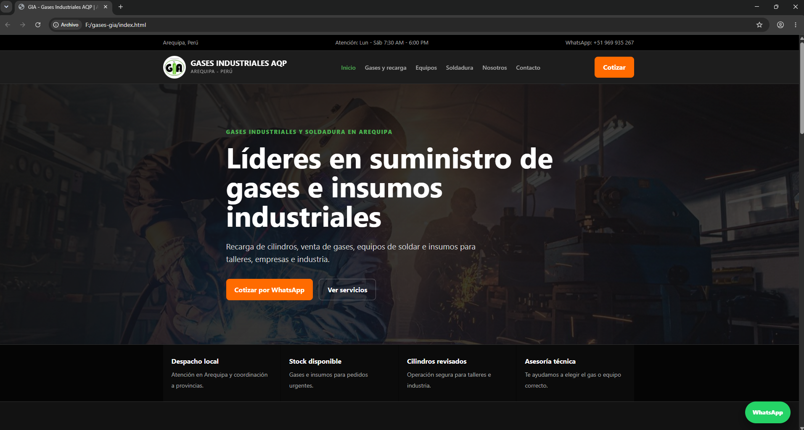
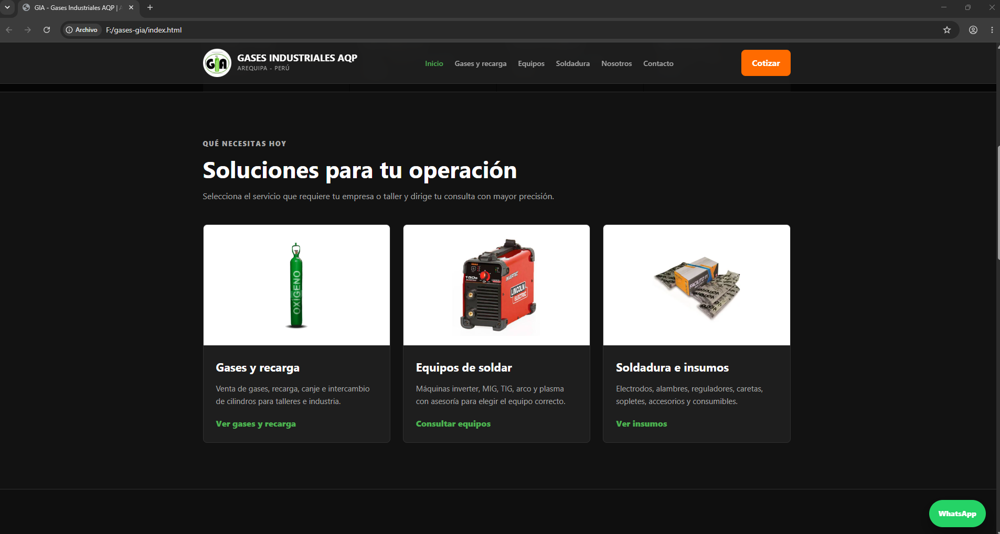
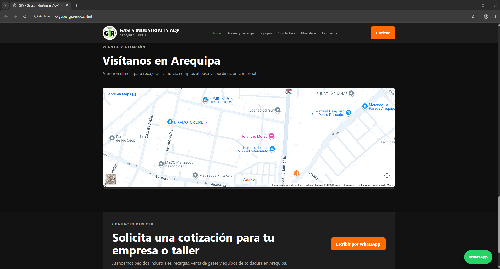
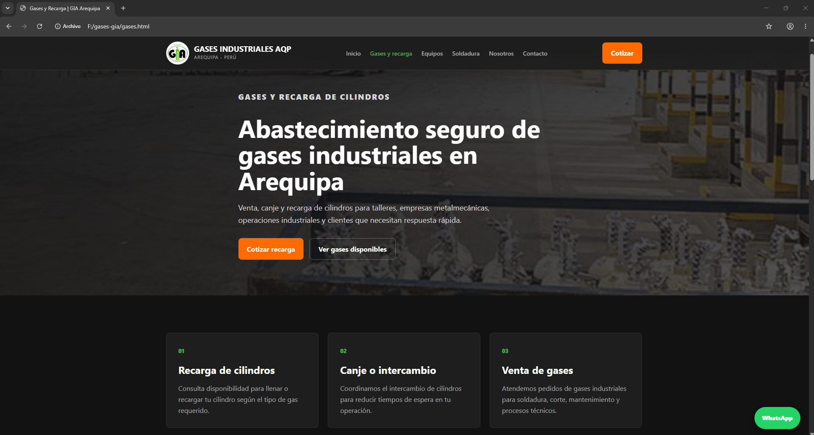
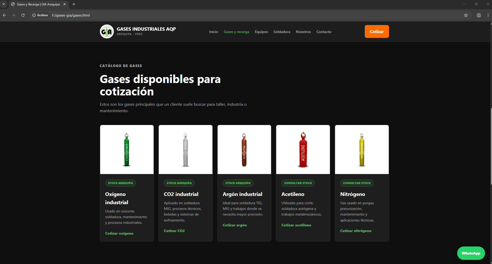
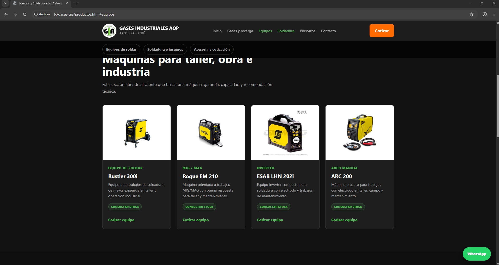
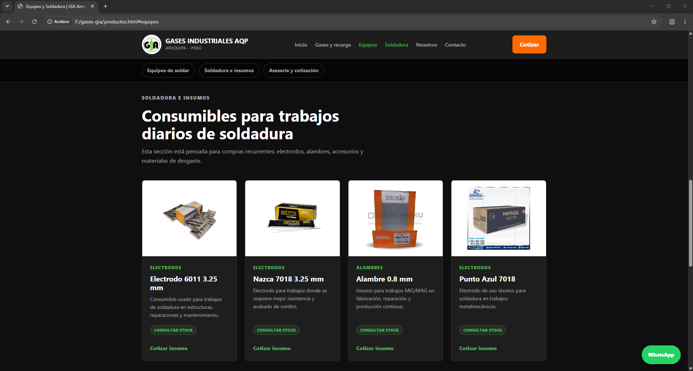
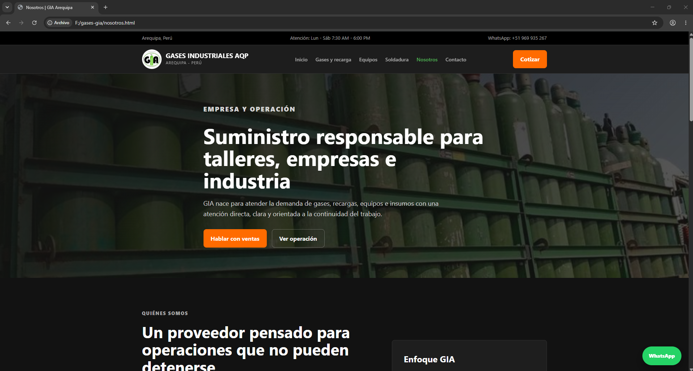
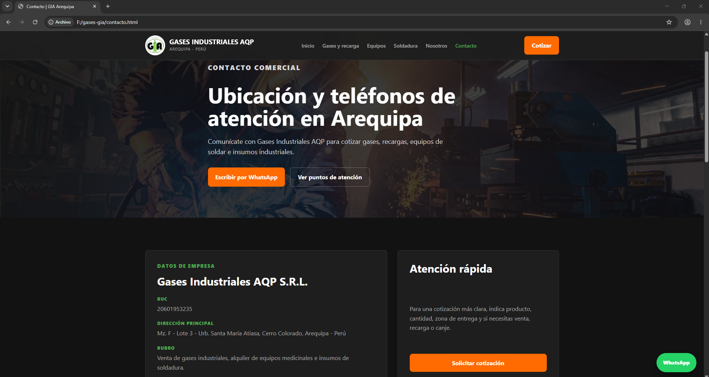

# Gases Industriales AQP Web

Sitio web corporativo desarrollado para presentar los servicios de una empresa de gases industriales en Arequipa, Peru. El objetivo del proyecto es construir una presencia digital profesional para clientes B2B, talleres, empresas metalmecanicas y usuarios que necesitan cotizar gases, recargas, equipos de soldar e insumos industriales.

## Demo

[Ver sitio publicado en GitHub Pages](https://christopherloayza21-eng.github.io/GasesIndustrialesAQPWeb/)

## Objetivo del proyecto

Este proyecto busca evitar una pagina industrial generica. La propuesta se enfoca en una interfaz moderna, oscura, directa y orientada a conversion, con llamadas claras a WhatsApp, informacion comercial visible y secciones separadas segun el tipo de necesidad del cliente.

## Tecnologias usadas

- HTML5
- CSS3
- JavaScript
- Git y GitHub
- GitHub Pages
- Diseno responsive
- Integracion con WhatsApp
- Google Maps embebido

## Paginas principales

- `index.html`: portada comercial, propuesta de valor, accesos rapidos y contacto.
- `gases.html`: gases industriales, recarga, canje y venta de cilindros.
- `productos.html`: equipos de soldar, soldadura e insumos separados por seccion.
- `nosotros.html`: presentacion de la empresa, enfoque operativo y confianza.
- `contacto.html`: datos de empresa, telefonos, puntos de atencion y mapa.

## Funcionalidades implementadas

- Navegacion entre paginas internas.
- Menu adaptable para celular.
- Botones directos a WhatsApp.
- Boton flotante de WhatsApp visible durante la navegacion.
- Secciones comerciales por tipo de servicio.
- Catalogo visual de gases, equipos e insumos.
- Mapa de ubicacion.
- Estructura separada en HTML, CSS y JavaScript.

## Capturas del proyecto

### Inicio



La portada comunica rapidamente el rubro de la empresa, la zona de atencion y las acciones principales: cotizar por WhatsApp o revisar los servicios disponibles.



La seccion de soluciones divide el negocio en rutas claras para el cliente: gases y recarga, equipos de soldar, y soldadura e insumos.



La parte final del inicio incluye mapa, llamada a cotizacion y acceso directo al contacto comercial.

### Gases y recarga



Esta pagina presenta el servicio de abastecimiento, recarga, canje y venta de gases industriales para talleres y empresas.



El catalogo muestra gases principales como oxigeno, CO2, argon, acetileno y nitrogeno, con botones de cotizacion directa.

### Equipos y soldadura



La seccion de equipos esta pensada para clientes que buscan maquinas de soldar, capacidad tecnica y asesoramiento antes de comprar.



La seccion de soldadura separa consumibles como electrodos, alambres y materiales de trabajo diario.

### Nosotros y contacto



La pagina Nosotros refuerza la confianza mostrando el enfoque operativo de la empresa y su orientacion a continuidad de trabajo.



La pagina Contacto centraliza datos de empresa, direccion principal, telefonos y acceso rapido para solicitar cotizacion.

## Estructura del proyecto

```text
.
+-- css/
|   +-- style.css
+-- docs/
|   +-- screenshots/
+-- img/
+-- js/
|   +-- main.js
+-- index.html
+-- gases.html
+-- productos.html
+-- nosotros.html
+-- contacto.html
+-- README.md
```

## Aprendizajes del proyecto

- Separacion entre estructura HTML, estilos CSS y comportamiento JavaScript.
- Uso de clases reutilizables para botones, tarjetas, secciones y navegacion.
- Diseno responsive para adaptar la web a escritorio y celular.
- Uso de Git para guardar avances por commits.
- Publicacion gratuita de un sitio estatico con GitHub Pages.
- Organizacion de un proyecto real para presentarlo en portafolio.

## Proximos pasos

- Reemplazar imagenes de referencia por fotografias reales de la empresa.
- Agregar cotizador rapido con JavaScript.
- Incorporar filtros simples en el catalogo de productos.
- Mejorar SEO basico con metadatos y textos alternativos.
- Usar este proyecto como base para un futuro sistema de inventario y ventas.
